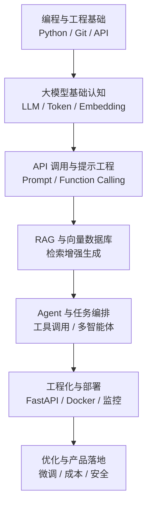

### **AI 应用开发的学习顺序：先打好编程与数据基础，再掌握大模型 API 与提示工程，接着深入 RAG、Agent 与工程化部署，最后走向优化与产品落地**

AI 应用开发（尤其是当下以大模型为核心的应用开发）不需要你先成为算法科学家，但需要循序渐进地建立"能把模型用起来、串起来、部署上线"的能力。下面按照从基础到进阶的合理顺序展开说明，你可以根据自己的起点跳过已掌握的部分。

### **第一阶段：编程与工程基础**

这是所有后续内容的地基。核心是 **Python**，因为绝大多数 AI 生态（SDK、框架、示例）都以 Python 为主。你需要掌握：

- Python 基础语法、函数、面向对象、常用库（requests、json、异步 asyncio）；
- 命令行、包管理（pip/conda/uv）、虚拟环境；
- Git 版本控制与基本的 API 概念（HTTP、REST、JSON、鉴权）。

如果打算做完整产品，还应了解一点前端（HTML/JS 或 React）和后端框架（FastAPI/Flask），因为 AI 应用本质上仍是一个软件系统。

### **第二阶段：AI 与大模型基础认知**

这一阶段不要求你会手写神经网络，而是要理解"模型在做什么"，避免把它当黑箱乱用：

- 理解什么是大语言模型（LLM）、Token、上下文窗口、温度（temperature）等参数含义；
- 了解模型能力边界与"幻觉"问题、成本与延迟的权衡；
- 建立对文本、向量（Embedding）、相似度检索的直观认识。

有余力可以补充机器学习/深度学习的基本概念（训练、推理、微调的区别），但对应用开发者而言这是"了解"而非"精通"的层次。

### **第三阶段：调用大模型 API 与提示工程**

真正动手的起点，也是投入产出比最高的一步：

- 学会调用主流大模型 API（如各家的 Chat Completions 接口），处理请求、响应、流式输出与错误重试；
- 系统学习 **提示工程（Prompt Engineering）**：角色设定、少样本示例（few-shot）、思维链（Chain-of-Thought）、结构化输出（JSON schema / function calling）；
- 掌握 **函数调用 / 工具调用（Function Calling / Tool Use）**，让模型能触发外部函数，这是迈向 Agent 的关键一环。

建议此阶段就做一两个小项目（如智能问答、文本摘要、翻译助手）来巩固。

### **第四阶段：RAG 与向量数据库**

当你需要让模型基于"私有或最新知识"回答时，就进入检索增强生成（RAG）：

- 学习文档加载、切分（chunking）、向量化（Embedding）流程；
- 使用向量数据库（如 FAISS、Chroma、Milvus、pgvector）进行相似度检索；
- 搭建完整 RAG 管线：检索 → 拼接上下文 → 生成，并学会评估检索质量与优化召回。

这一阶段常配合 **LangChain / LlamaIndex** 等框架，帮助你更快搭建标准化管线。

### **第五阶段：Agent 与多步任务编排**

在能"问答"的基础上，进一步让 AI "自主行动"：

- 理解 Agent 的核心循环：规划 → 调用工具 → 观察结果 → 再决策；
- 学习工具编排、记忆（memory）、多智能体协作等模式；
- 使用相关框架（LangGraph、AutoGen、CrewAI 等）构建能完成复杂任务的应用。

### **第六阶段：工程化、部署与优化**

让应用从"能跑的 Demo"变成"可上线的产品"：

- 后端服务化（FastAPI）、容器化（Docker）、云部署；
- 处理并发、流式响应、成本控制、缓存与限流；
- 监控与可观测性（日志、追踪、评估指标），以及安全与提示注入防护；
- 视需求学习模型微调（Fine-tuning）或轻量化技术（如 LoRA），但这通常是较后期、有明确需求时才做。

### **贯穿始终：以项目驱动学习**

下面用一张流程图概括整体路径，帮助你把握先后关系：

最重要的一条建议是：**不要等"学完"再动手**。从第三阶段开始，每一步都配一个真实小项目（问答机器人 → 知识库助手 → 自动化 Agent），在做中学，遇到问题再回头补基础，这样进步最快，也最贴近实际的 AI 应用开发工作方式。